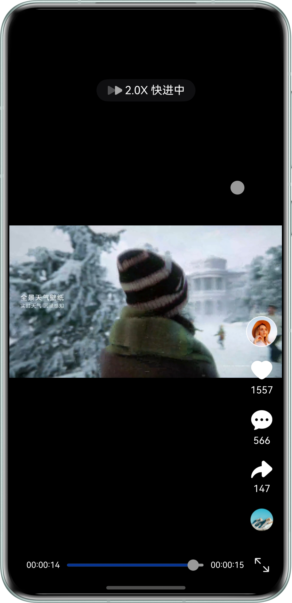
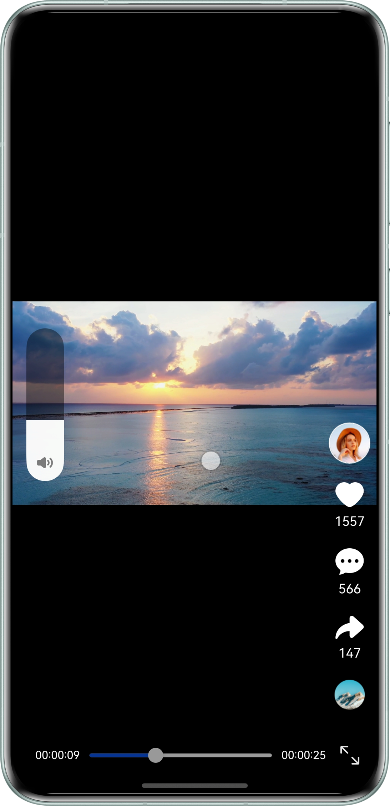
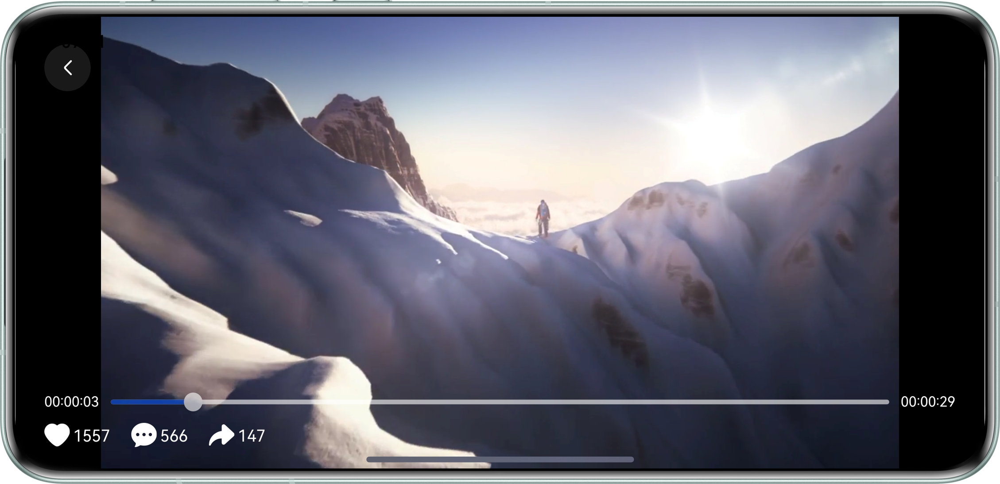

# 基于Video组件播放短视频

## 项目简介

本示例基于Video组件实现短视频播放，实现了包括基础播控、自定义进度条、全屏播放、跳转播放、播放倍速调节、自动连播、音量设置以及前后台状态感知等功能。

## 效果预览

| 基础播控                                | 播放倍速调节                              | 音量设置                                |           
|-------------------------------------|-------------------------------------|-------------------------------------|
|  |  |  |

| 全屏播放                                | 
|-------------------------------------|
|  |

## 使用说明

1. 启动应用后视频自动播放；点击视频画面可暂停，再次点击则继续播放。
2. 点击或拖动进度条，即可跳转至指定时间点。
3. 长按视频画面左侧或右侧，可将播放速度切换为2倍速。
4. 在视频画面上长按并垂直滑动，可调出音量控制条：上滑增大音量，下滑减小音量。
5. 点击进度条右侧的全屏按钮，或横置设备，均可进入全屏模式；进入全屏后，点击返回按钮即可退出。
6. 应用退至后台时，视频自动暂停；重新回到前台后，视频将从暂停处继续播放。
7. 当前视频播放结束后，将自动连播下一个视频。

## 工程目录

```
├───entry/src/main/ets
│   ├───common                        
│   │   ├───TimeUtils.ets                   // 时间工具
│   │   ├───VideoData.ets                   // 视频资源
│   │   ├───VideoDataModel.ets              // 视频定义类
│   │   └───WindowUtil.ets      	        // 窗口工具
│   ├───constants                               
│   │   └───CommonConstants.ets             // 常量
│   ├───entryability                        
│   │   └───EntryAbility.ets                // Ability的生命周期回调内容
│   ├───entrybackupability                  
│   │   └───EntryBackupAbility.ets          // 程序备份和恢复
│   ├───pages                               
│   │   └───Index.ets                       // 首页
│   └───view
│       ├───SetVolume.ets                   // 音量调节                             
│       └───VideoPlayer.ets                 // 视频播放
└───entry/src/main/resources                // 资源目录          
```

## 具体实现

1. 创建VideoController视频控制器，调用其start()和pause()方法分别播放和暂停视频。
2. 设置Video组件的controls属性为false，禁用Video组件自带的控制条。使用Slider组件实现自定义进度条，通过setCurrentTime()指定视频播放的进度位置，实现跳转播放。
3. 通过LongPressGesture()长按手势事件，设置Video组件的播放速度currentProgressRate值为Speed_Forward_2_00_X，实现2倍速播放。
4. 通过长按和滑动的组合手势事件，调出AVVolumePanel音量面板并设置音量大小。
5. 调用窗口的setPreferredOrientation方法，设置主窗口的显示方向属性，实现横竖屏切换。
6. 通过onForeground()和onBackground()生命周期方法监听当前应用的前后台状态，处于后台时视频暂停播放，回到前台后视频恢复播放。
7. 视频播放完后，调用Swiper组件的showNext()跳转到下一个视频，同时在Swiper切换回调里调用Video组件的start()播放视频，实现自动连播。

## 相关权限

不涉及

## 依赖

不涉及

## 约束与限制

1. 本示例仅支持标准系统上运行，支持设备：直板机。
2. HarmonyOS系统：HarmonyOS 6.0.2 Release及以上。
3. DevEco Studio版本：DevEco Studio 6.0.2 Release及以上。
4. HarmonyOS SDK版本：HarmonyOS 6.0.2 Release SDK及以上。